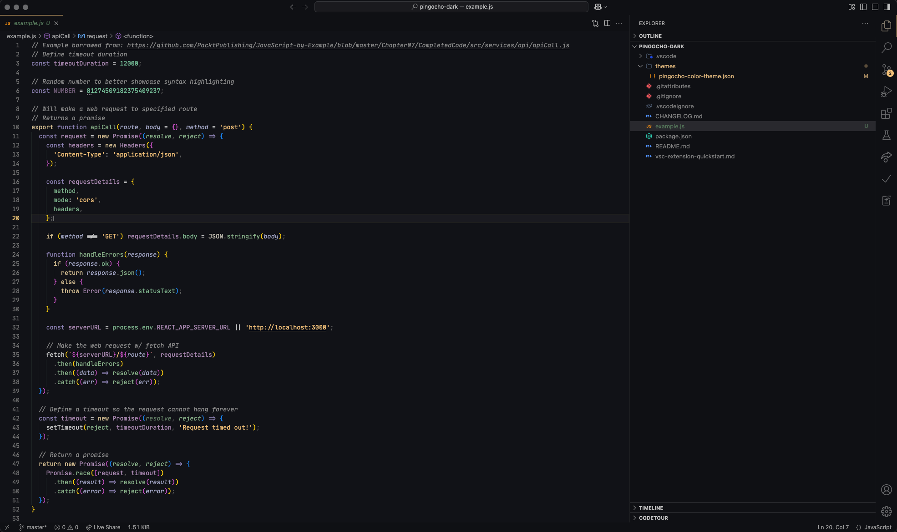

# Pingocho Dark Theme for VSCode

Pingocho Dark is a modern and visually appealing dark theme for Visual Studio Code, designed to provide an optimal coding experience with a carefully curated color scheme.

## 🎨 Features

- **Dark Background**: A deep, eye-friendly dark gray background to reduce eye strain.
- **Highlighted Keywords**: Keywords, functions, and variables are easily distinguishable with a well-balanced color palette.
- **Readable Comments**: Comments are styled in a subtle yet readable greenish tone.
- **Accent Colors**: Carefully chosen yellow, blue, and purple shades to enhance syntax highlighting.
- **Consistent Styling**: Ensures clear visibility for different file types, including JavaScript, TypeScript, HTML, and CSS.

## 📷 Preview



## 🚀 Installation

1. **Manual Installation** (using `.vsix` file):

   - Download the `.vsix` file.
   - Open VS Code and run `Extensions: Install from VSIX...` from the command palette (`Ctrl+Shift+P` / `Cmd+Shift+P`).
   - Select the downloaded `.vsix` file and install it.

2. **Marketplace Installation** (when published):
   - Go to the **Extensions** view (`Ctrl+Shift+X` / `Cmd+Shift+X`).
   - Search for `Pingocho Dark`.
   - Click **Install** and activate the theme.

## 🎛️ Activation

After installation:

- Open **Command Palette** (`Ctrl+Shift+P` / `Cmd+Shift+P`).
- Search for `Preferences: Color Theme`.
- Select **Pingocho Dark** from the list.

## 🛠️ Customization

If you want to tweak the theme, you can modify the `pingocho-color-theme.json` file located in:

```
.vscode/extensions/
```

Adjust colors and reload VS Code to apply the changes.

## 📌 Contributions

Feel free to fork this project, submit issues, or suggest improvements!

## 📜 License

MIT License
